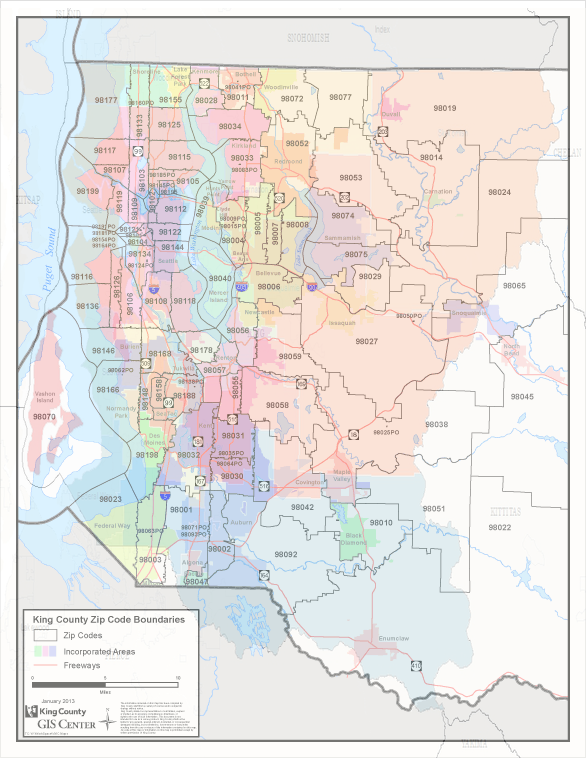

# King County Washington

## Overview
Flatiron School Data Science Phase 2 project.

## Business Problem

Edconsult is working with King County, Wa to improve education through winning local school district elections to increase funding for both new buildings and increased teacher pay.

Edconsult needs to demonstrate to the taxpayers / homeowners that in investment in the schools, is an investment in their property value.

## Data Used
data from the following sources can be found in the 'data' folder.

King County Housing Sales 5/2014 - 5/2015
Zipcode and School District data from [proximityone.com](http://proximityone.com/zip-sd.htm)

## School Districts By Zipcode

## Deliverables
* [Non-Technical Presentation](https://github.com/ceflynn/dsc-phase-2-project-v2-3/blob/main/pdf/King%20County%20Washington.pdf)
* [GitHub Repository](https://github.com/ceflynn/dsc-phase-2-project-v2-3)
* [Jupyter Notebook](https://github.com/ceflynn/dsc-phase-2-project-v2-3/blob/main/student.ipynb)

## OESMN Framework
Obtain
Scrub
Explore
Model
Interpret

## Model and Regression Results

OLS Model - Ordinar Least Squares Regression

R-Squarred .795  
P-Values of predictors all below our selected alpha(.005)

Our Model can account for roughly 80% of the variance in housing price.

## Client Questions / Answers
### Best Predictors of Price
Our model suggests as one might expect that the location and the size of the home are the best positive predictors of price. It also suggest that the grade of the house plays a great factor in determining the price.

From King County Assesors:

"Classification by construction quality which refers to the types of materials used and the quality of workmanship. Buildings of better quality (higher grade) cost more to build per unit of measure and command higher value. (See Glossary in Area Report for Residential Building Grades in use by the King County Department of Assessments.)"""<

https://info.kingcounty.gov/assessor/esales/Glossary.aspx?type=r#g

A grade of 13_Mansion is one of our top positive predictors. But there is only one house included.

grades 4-7 are amoung our top negative price predictors. These all roughly deal with the quality of the build.

### How School District Affects Pricte

School districts ranked very high in our models coefficient list.  They are a primary factor.  School Districts listed below:

Mercer Island: 0.8295
Bellevue 0.735009
Seattle: 0.6466
Lake Washington: 0.6031
Issaquah: 0.5215
Northshore: 0.4527
Shoreline: 0.4442
Snoqualmie Valley: 0.4052
Riverview: 0.3948
Vashon Island: 0.3626
Renton: 0.2861
Tahoma: 0.2024
Highline: 0.1706
Enumclaw: 0.1166
Tukwila: 0.1017
Kent: 0.0924

Mercer Island had the highest coefficient in the model. 

### Which Districts to Target

Snoqualmie Valley, Vashon Island,Riverview,Shoreline, Renton, Tahoma, Enumclaw, Highline 

These districts were in the middle of both of our coefficient rankings and home value rankings.

 